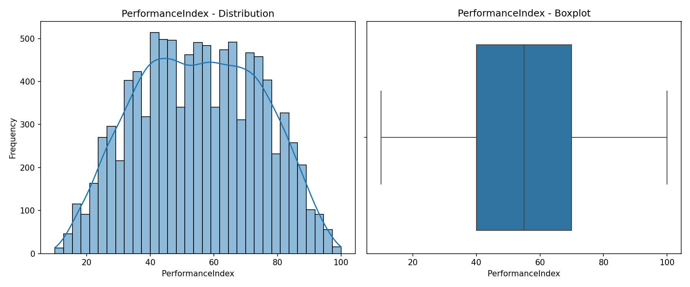
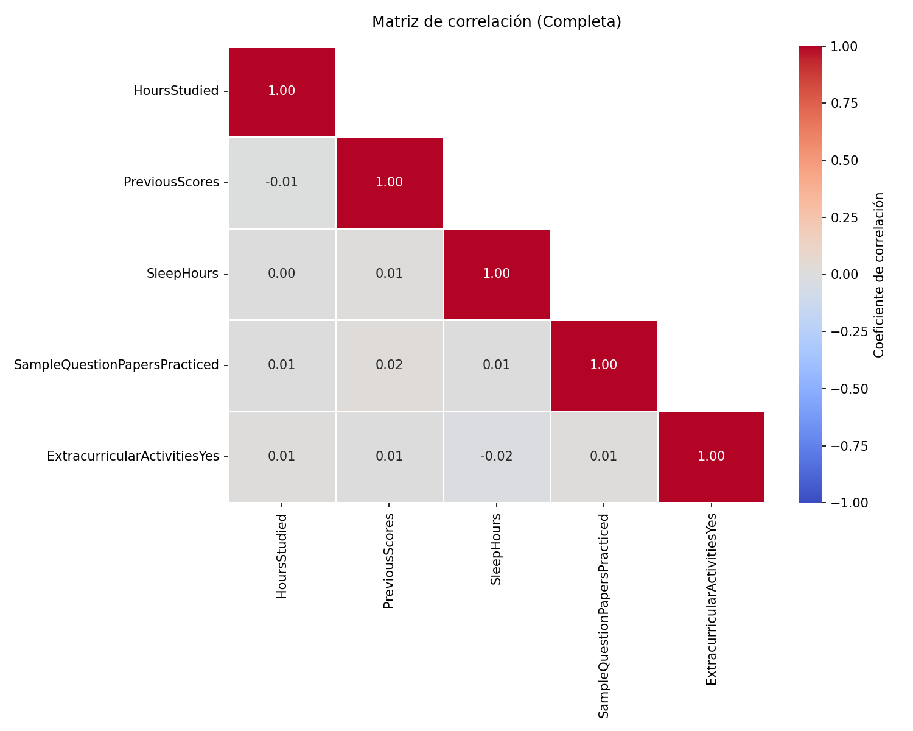
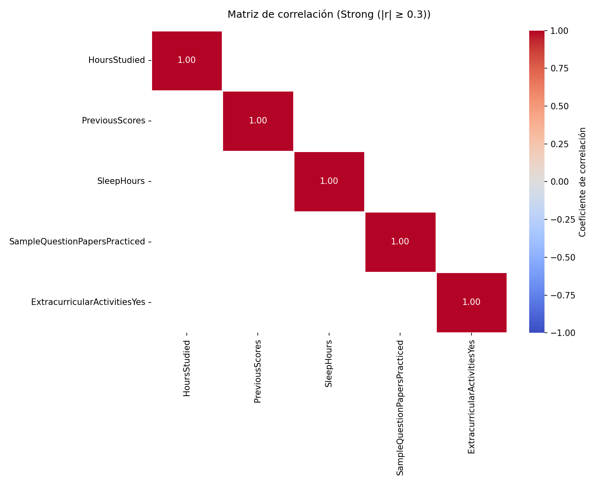
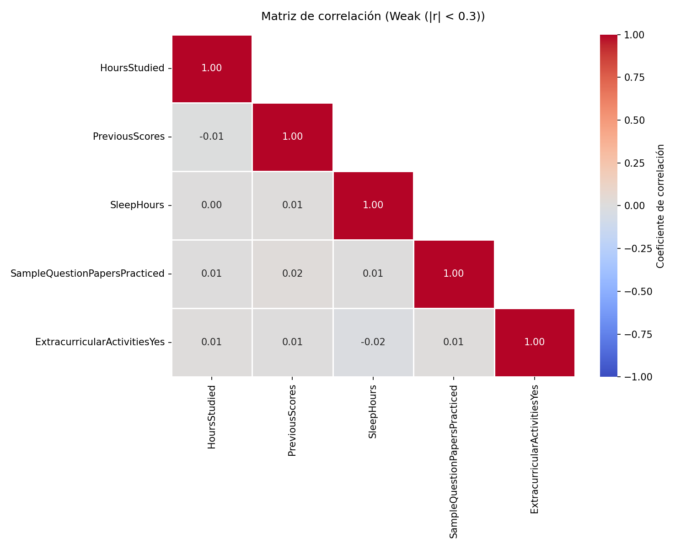
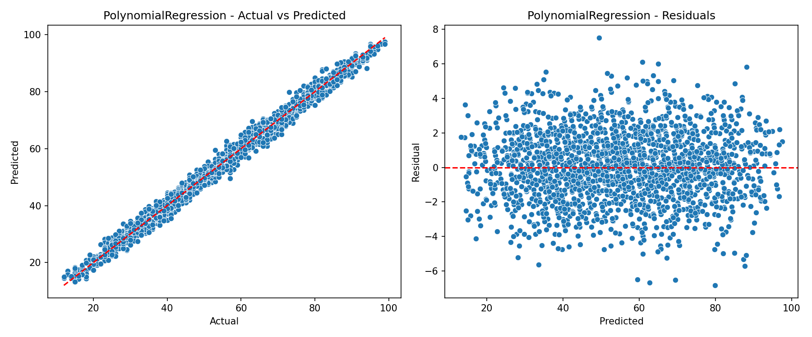
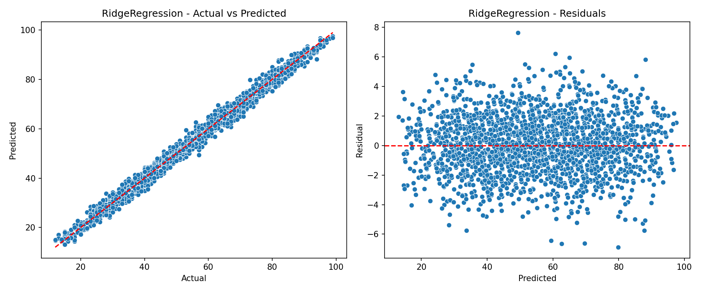

# Proyecto de Algoritmos de Regresión

Este proyecto aplica dos algoritmos de regresión a un conjunto de datos usando Python. El flujo descarga el dataset, lo descomprime, lo carga con `pandas`, realiza limpieza, visualiza información relevante, divide los datos en entrenamiento/prueba, entrena los modelos y compara sus resultados.

## Estructura

- `App.py`: Script principal para cargar datos, entrenar modelos y evaluar resultados.
- `Data/`: Archivos del conjunto de datos.
- `Assets/`: Imágenes, documentos o recursos del proyecto, como `Semana1.pdf`.
- `Assets/Results/`: Copia de los gráficos generados para evidenciar los resultados del análisis.
- `Base/`: Archivos locales ignorados por Git.
- `Temp/`: Carpeta temporal donde se descarga y descomprime el dataset durante la ejecución. Está ignorada por Git.
- `Results/`: Carpeta donde se guardan los gráficos generados por cada ejecución. Está ignorada por Git.
- `App.bat`: Lanzador para Windows CMD.
- `App.ps1`: Lanzador para Windows PowerShell.
- `App`: Lanzador para sistemas Unix-like.

## 1. Descargar Este Repositorio

Clonar el repositorio con Git:

```bash
git clone https://github.com/UIDE-Tareas/10-Machine-Learning-Supervised-And-Unsupervised-Tarea1.git
cd 10-Machine-Learning-Supervised-And-Unsupervised-Tarea1
```

También se puede descargar desde GitHub como archivo ZIP y extraerlo en el computador.

## 2. Ejecutar El Proyecto

No ejecutar `App.py` directamente. Se debe usar el lanzador correspondiente al sistema operativo.

La razón es que el lanzador crea un entorno virtual `.venv` y ejecuta `App.py` usando el Python de ese entorno. De esta forma, las librerías necesarias se instalan dentro del proyecto y no modifican el ambiente local de la máquina que ejecuta el script.

### Windows CMD

```bat
App.bat
```

### Windows PowerShell

```powershell
.\App.ps1
```

### Sistemas Unix-like

```bash
chmod +x App
./App
```

## 3. Fases Del Proyecto

El script sigue una estructura por etapas:

1. **Dataset URL**
   
   Muestra la URL del dataset utilizado.

2. **Download Dataset**
   
   Descarga `archive.zip` desde GitHub Raw hacia la carpeta `Temp/`. Si el archivo ya existe, no lo vuelve a descargar.

3. **Read Dataset**
   
   Descomprime el archivo ZIP si es necesario y lee `Student_Performance.csv` con `pandas`.

4. **Inspect DataFrame**
   
   Muestra información inicial de `dfRaw`: estructura, nulos, duplicados, estadística descriptiva y primeras filas.

5. **Clean DataFrame**
   
   Crea `dfClean` a partir de `dfRaw`. Aplica One-Hot Encoding, convierte columnas booleanas a `0/1`, elimina duplicados, elimina valores nulos y normaliza nombres de columnas.

6. **Target Distribution**
   
   Grafica la distribución de la variable objetivo `PerformanceIndex` con histograma y boxplot.

7. **Train Test Split**
   
   Divide el dataset limpio en entrenamiento y prueba usando `80%` para entrenamiento y `20%` para prueba.

8. **Train Correlation Matrices**
   
   Muestra matrices de correlación sobre `X Train`: completa, fuerte y débil.

9. **Configure Regressors**
   
   Configura los modelos de regresión:
   - `PolynomialRegression`
   - `RidgeRegression`

10. **Train And Evaluate Regressors**
   
   Entrena los dos modelos, predice sobre test, calcula métricas y genera gráficos de resultados.

11. **Compare Regressors**
   
   Compara los modelos usando `RMSE` y `R2`, e indica cuál tiene mejor desempeño.

## 4. Dataset Utilizado

El dataset usado es:

```text
Student_Performance.csv
```

Fuente original:

```text
https://www.kaggle.com/datasets/nikhil7280/student-performance-multiple-linear-regression
```

Este dataset se usa porque contiene una variable objetivo numérica, `PerformanceIndex`, adecuada para problemas de regresión supervisada. Las variables predictoras incluyen horas de estudio, puntajes previos, horas de sueño, exámenes practicados y actividades extracurriculares.

### Descripción Del Dataset

El dataset **Student Performance** fue diseñado para examinar factores que pueden influir en el rendimiento académico de estudiantes. Contiene `10,000` registros, donde cada fila representa a un estudiante y contiene variables predictoras junto con un índice de rendimiento.

Variables predictoras:

- `Hours Studied`: total de horas estudiadas por cada estudiante.
- `Previous Scores`: puntajes obtenidos por los estudiantes en pruebas anteriores.
- `Extracurricular Activities`: indica si el estudiante participa en actividades extracurriculares, con valores `Yes` o `No`.
- `Sleep Hours`: promedio de horas de sueño por día.
- `Sample Question Papers Practiced`: cantidad de cuestionarios o exámenes de práctica realizados.

Variable objetivo:

- `Performance Index`: medida del rendimiento académico general del estudiante. Está redondeada al entero más cercano y toma valores entre `10` y `100`; valores más altos indican mejor rendimiento.

El objetivo del dataset es permitir el análisis de la relación entre las variables predictoras y el índice de rendimiento. En este proyecto se usa para entrenar modelos que intentan predecir `PerformanceIndex` a partir de hábitos de estudio, rendimiento previo, sueño, práctica y actividades extracurriculares.

Es importante aclarar que este dataset es **sintético** y fue creado con fines ilustrativos. Por lo tanto, las relaciones observadas entre variables no necesariamente representan escenarios reales.

Licencia: cualquier persona puede compartir y usar los datos.

## 5. Archivos Generados

Durante la ejecución se generan archivos temporales y resultados:

- `Temp/archive.zip`: archivo ZIP descargado.
- `Temp/Student_Performance.csv`: archivo CSV descomprimido.
- `Results/YYYYMMdd-HHMMSS/`: carpeta de resultados de una ejecución específica.
- `Results/YYYYMMdd-HHMMSS/CorrelationMatrix_ALL.png`: matriz de correlación completa.
- `Results/YYYYMMdd-HHMMSS/CorrelationMatrix_STRONG.png`: matriz de correlación fuerte.
- `Results/YYYYMMdd-HHMMSS/CorrelationMatrix_WEAK.png`: matriz de correlación débil.
- `Results/YYYYMMdd-HHMMSS/PerformanceIndex_Distribution.png`: distribución de la variable objetivo.
- `Results/YYYYMMdd-HHMMSS/PolynomialRegression_RegressionResults.png`: gráficos del modelo polinomial.
- `Results/YYYYMMdd-HHMMSS/RidgeRegression_RegressionResults.png`: gráficos del modelo Ridge.

Las carpetas `Temp/` y `Results/` están en `.gitignore` para evitar subir archivos generados o temporales al repositorio.

Los gráficos de la ejecución revisada también se copiaron en:

```text
Assets/Results/
```

Esto permite conservar evidencia visual dentro del repositorio sin depender de la carpeta temporal `Results/`.

## 6. Análisis De Gráficos Generados

### Distribución De `PerformanceIndex`

Archivo:

```text
Assets/Results/PerformanceIndex_Distribution.png
```



El histograma muestra que `PerformanceIndex` se distribuye en un rango aproximado de `10` a `100`, con mayor concentración en valores medios. El boxplot no evidencia valores extremos fuertes, por lo que la variable objetivo parece adecuada para modelos de regresión sin una limpieza agresiva de outliers.

### Matrices De Correlación

Archivos:

```text
Assets/Results/CorrelationMatrix_ALL.png
Assets/Results/CorrelationMatrix_STRONG.png
Assets/Results/CorrelationMatrix_WEAK.png
```







La matriz completa se calcula sobre `X Train`, es decir, solo sobre las variables predictoras del conjunto de entrenamiento. Esto evita usar información del conjunto de prueba durante el análisis exploratorio posterior al split.

En la matriz completa se observa que las correlaciones entre predictores son bajas. Con el umbral `0.30`, la matriz fuerte no muestra relaciones fuertes entre variables predictoras fuera de la diagonal. Esto indica baja multicolinealidad entre las variables de entrada, lo cual es positivo para modelos lineales y regularizados como Ridge.

La columna `ExtracurricularActivitiesYes` aparece como variable numérica porque después del One-Hot Encoding las columnas booleanas se convierten a `0/1`.

### Resultados De Regresión

Archivos:

```text
Assets/Results/PolynomialRegression_RegressionResults.png
Assets/Results/RidgeRegression_RegressionResults.png
```





Los gráficos `Actual vs Predicted` muestran que las predicciones de ambos modelos se alinean muy cerca de la línea ideal. Esto sugiere que los modelos capturan bien la relación entre las variables predictoras y `PerformanceIndex`.

Los gráficos de residuos muestran errores distribuidos alrededor de `0`, sin un patrón curvo evidente. Esto es una buena señal: indica que los modelos no presentan un sesgo visual fuerte en las predicciones. Ridge y Polynomial Regression muestran resultados visualmente muy similares en esta ejecución.

## 7. Constantes Configurables

Las principales constantes configurables están al inicio de `App.py`:

- `RANDOM_STATE = 216`
  
  Controla la reproducibilidad de operaciones aleatorias como el split.

- `TRAIN_RATIO = 0.80`
  
  Define el porcentaje de datos usado para entrenamiento.

- `TEST_RATIO = 0.20`
  
  Define el porcentaje de datos usado para prueba.

- `POLYNOMIAL_DEGREE = 2`
  
  Define el grado usado por la regresión polinomial.

- `RIDGE_ALPHA = 1.0`
  
  Define la fuerza de regularización del modelo Ridge.

- `CORRELATION_THRESHOLD = 0.30`
  
  Define el umbral usado para clasificar correlaciones fuertes o débiles.

- `SHOW_PLOTS = True`
  
  Controla si los gráficos se muestran en pantalla.

- `SAVE_PLOTS = True`
  
  Controla si los gráficos se guardan en la carpeta `Results/`.

- `DATASET_URL`
  
  URL de la página original del dataset en Kaggle.

- `DATASET_ARCHIVE_RAW_URL`
  
  URL directa del archivo ZIP en GitHub Raw.

- `DATASET_ARCHIVE_FILENAME = "archive.zip"`
  
  Nombre del archivo ZIP descargado.

- `DATASET_CSV_FILENAME = "Student_Performance.csv"`
  
  Nombre del CSV dentro del ZIP.

- `TARGET_COLUMN = "PerformanceIndex"`
  
  Variable objetivo que los modelos intentan predecir.

- `TEMP_DIR = "Temp"`
  
  Carpeta temporal usada para descarga y descompresión.

- `RESULTS_DIR = Path("Results")`
  
  Carpeta principal donde se almacenan resultados.

## 8. Modelos Y Métricas

Los modelos utilizados son:

- `PolynomialRegression`: usa `PolynomialFeatures`, `StandardScaler` y `LinearRegression`.
- `RidgeRegression`: usa `StandardScaler` y `Ridge`.

Las métricas calculadas son:

- `MAE`: Error absoluto medio.
- `MSE`: Error cuadrático medio.
- `RMSE`: Raíz del error cuadrático medio.
- `R2`: Coeficiente de determinación.
